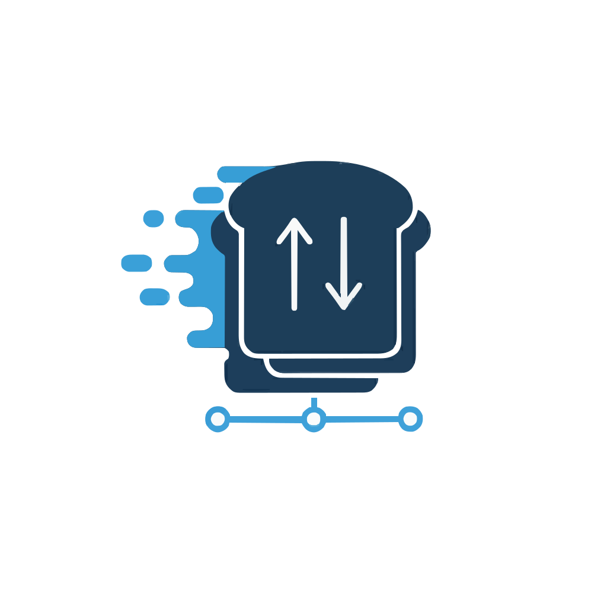

# Toasty: Speeding Up Network I/O with Cache-Warm Buffers</h1>

Toasty is a software framework that enables the reuse of a small working set of cache-warm packet buffers in steady traffic conditions, while automatically expanding to a larger buffer pool to avoid packet drops during traffic bursts. The adaptive RX ring refilling in the kernel driver is available in the <a href="https://github.com/Preeti1012/Toasty-kernel">Toasty</a> out-of-tree linux repository.

**Toasty consists of two key ideas:**

- **LIFO-Based Cache-Warm Buffer Reuse (implemented in user-space on top of AF_XDP)**
Toasty manages free packet buffers as a LIFO stack, ensuring that recently freed, cache-warm buffers are reused immediately for incoming packet DMA.

- **Adaptive RX Ring Filling (implemented in kernel-space)**
Toasty dynamically controls the number of descriptors populated in the NIC RX ring: it uses a small set of warm buffers under steady traffic and expands the ring during traffic bursts to avoid packet loss.

**Workloads** used for evaluation are NAT, IDS, Decryption, L2Fwd, MICA, and Maglev. All of these applications are built on top of AF_XDP present in the /bpf/AF_XDP/toasty file. To set up Toasty in busy-polling mode, run the setup_script.sh present in the /setup_scripts folder.s

<!-- Installation -->

<!-- Usage -->
